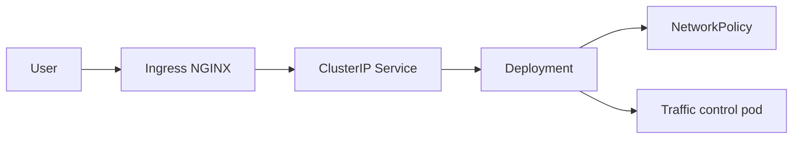

# Kubernetes networking lab

This repository demonstrates Kubernetes networking fundamentals in a compact, reviewable lab. It is designed to show how application exposure, namespace isolation, and traffic impairment fit together without requiring a large platform stack.

The lab includes:

- a namespace-scoped sample application
- a ClusterIP service
- an ingress object for `ingress-nginx`
- a default-deny NetworkPolicy
- a targeted allow rule for ingress traffic to the app
- a traffic-control pod that applies `tc netem`

The manifests are intentionally small so the network behavior can be read, applied, and adjusted without digging through a large stack.

## What this demonstrates

- Kubernetes service discovery through labels and selectors
- ingress-to-service routing for HTTP traffic
- namespace-level isolation with a default-deny policy
- controlled policy exceptions for ingress traffic
- traffic impairment testing with Linux `tc netem`
- CI validation for manifest structure and wiring

## Layout

- `manifests/` holds the Kubernetes YAML
- `scripts/validate_manifests.py` checks that the bundle is internally consistent
- `tests/` covers the manifest helpers
- `docs/` contains run notes
- `diagrams/` contains the topology sketch
- `screenshots/` is a placeholder only

## Local setup

```bash
python -m pip install -r requirements-dev.txt
```

Optional cluster tooling:

- `kubectl`
- a local cluster such as kind, minikube, or Docker Desktop Kubernetes
- `ingress-nginx` if you want to test the ingress path end to end

## Apply the lab

```bash
kubectl apply -k manifests
kubectl get all -n k8s-network-lab
```

The ingress example expects an `ingress-nginx` controller to be installed in the cluster.

## Architecture



## Validation

```bash
python scripts/validate_manifests.py
pytest
```

The validation script checks kustomization membership, required Kubernetes fields, service and ingress wiring, and the `NET_ADMIN` capability required by the traffic-control pod.

## Cleanup

```bash
kubectl delete -k manifests
```
